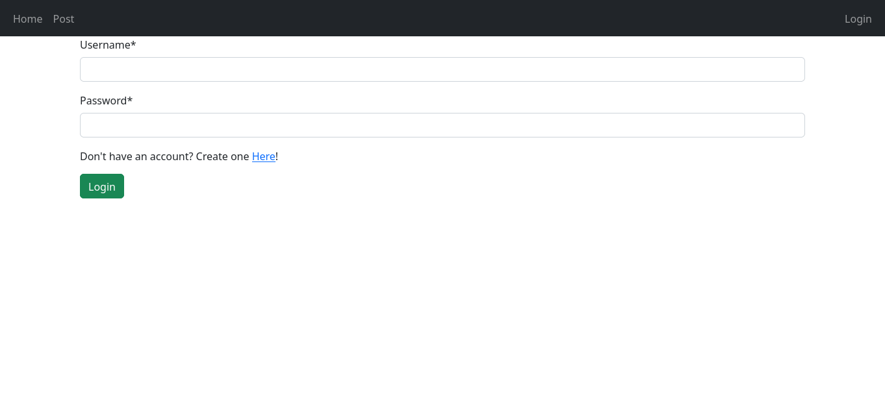
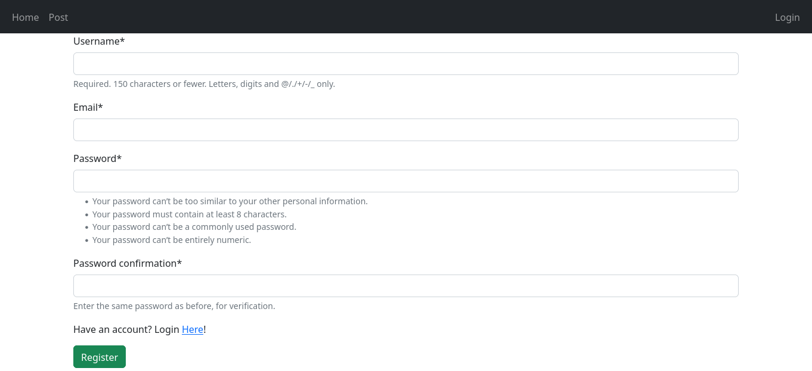
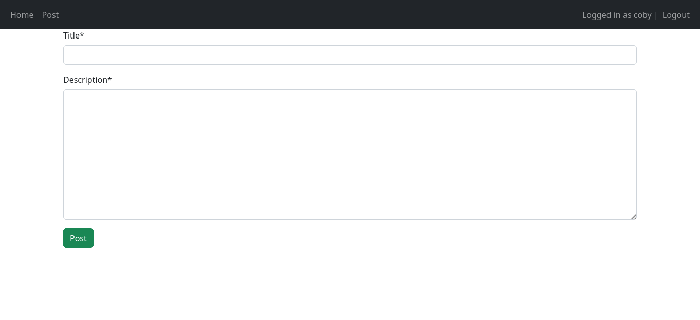
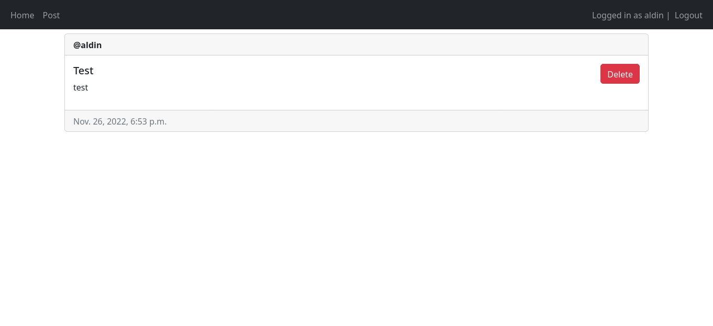
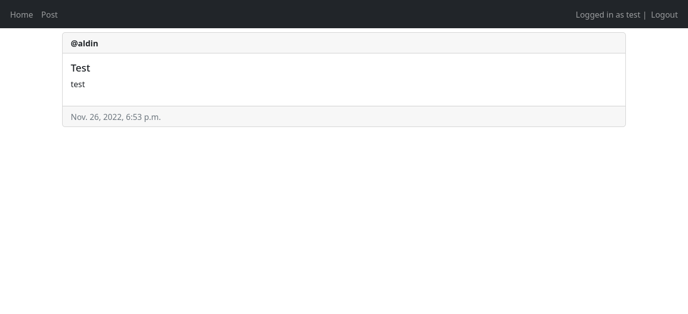
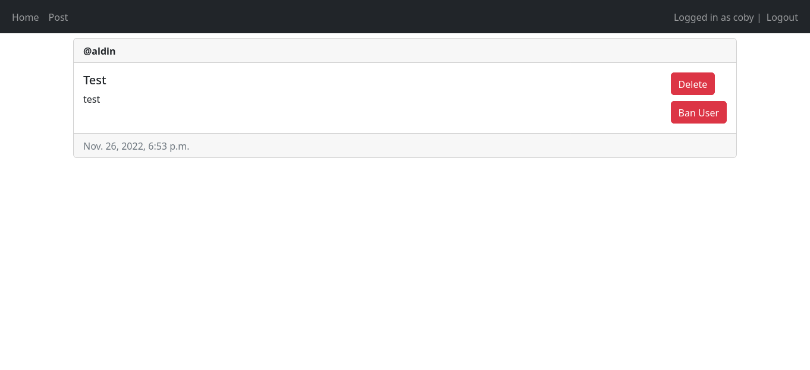

# twiter_clone

## This is User Managment Project made in Django Framework

### Login page

### SignUp page

### User Can Post

### User Can Delete Posts

### Home Page Ro See Other Posts

### Admin User That Can Delete Everything And Ban Users

